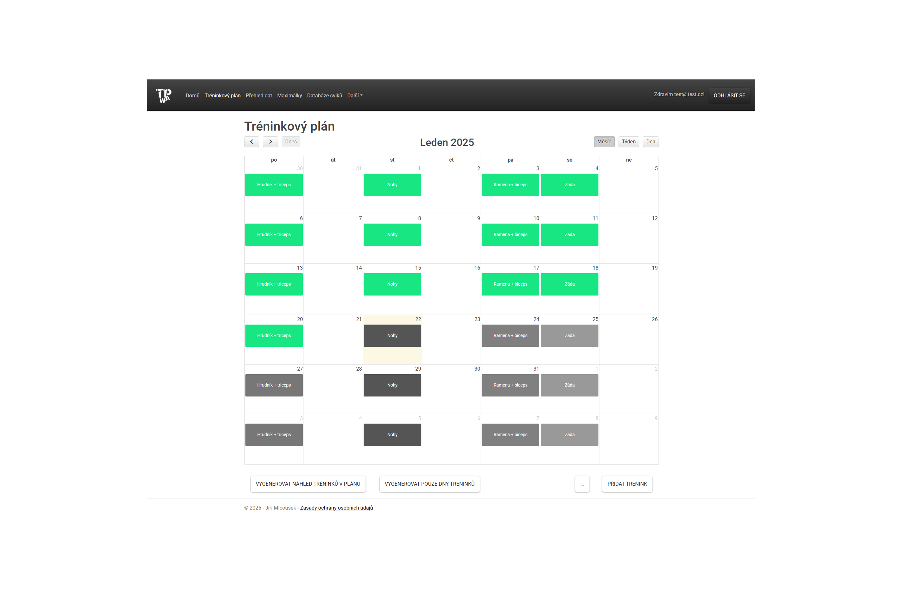

# Aplikace pro vytváření tréninkových plánů

Tento projekt je součástí mé bakalářské práce na téma **"Aplikace pro vytváření tréninkových plánů"**. Cílem aplikace je umožnit fitness nadšencům a sportovcům vytvářet tréninkové plány na míru, sledovat svůj pokrok a zlepšovat efektivitu tréninků.

---

## Funkcionality

- **Vytvoření uživatelského účtu**: Registrace a přihlášení uživatelů s možností správy účtu.
- **Tvorba tréninkových plánů**: Personalizované plány na základě cílů a úrovně zkušeností.
- **Zaznamenávání zpětné vazby**: Možnost ukládání výsledků jednotlivých tréninků.
- **Statistiky a vizualizace**: Přehled výsledků a pokroku zobrazený pomocí grafů.
- **Export do PDF**: Vygenerování a stažení plánů a výsledků.

---

## Screenshoty

### 1. Registrace uživatele

### 2. Tréninkový plán

### 3. Statistiky

---

## Jak spustit projekt

Aplikaci si můžete vyzkoušet na následující adrese: [Aplikace](http://tpwebapp1-001-site1.mtempurl.com/)
- username: 11214711
- heslo: 60-dayfreetrial

V aplikace je vytvořen testovací uživatel s emailem: test@test.cz a s heslem: **Test123**
V případě vytváření vlastního účtu pokračujte dle návodu v textu bakalářské práce. 

---

## Jak používat aplikaci

### 1. Registrace a přihlášení
- Pro registraci klikněte na **"Zaregistrovat se"**.
- Vyplňte formulář (viz obrázek výše) a potvrďte e-mail.

### 2. Vytvoření tréninkového plánu
- Po přihlášení přejděte do sekce **"Tréninkový plán"**.
- Vyberte cíle (např. budování svalové hmoty) a frekvenci tréninků.
- Uložte plán a začněte trénovat.

### 3. Sledování pokroku
- V sekci **"Přehled dat"** a **Maxilálky** si zobrazte grafy a přehled výsledků.
- Exportujte svůj plán nebo data do PDF pro offline použití.

---

## Hlavní struktura projektu

- `Controllers/`: Zpracování logiky aplikace.
- `Models/`: Datové modely pro interakci s databází.
- `Views/`: Uživatelské rozhraní.

---

## Další informace

Pokud máte jakékoli otázky nebo problémy, kontaktujte mě na [jirka.mlcousek@seznam.cz](mailto:jirka.mlcousek@seznam.cz).
